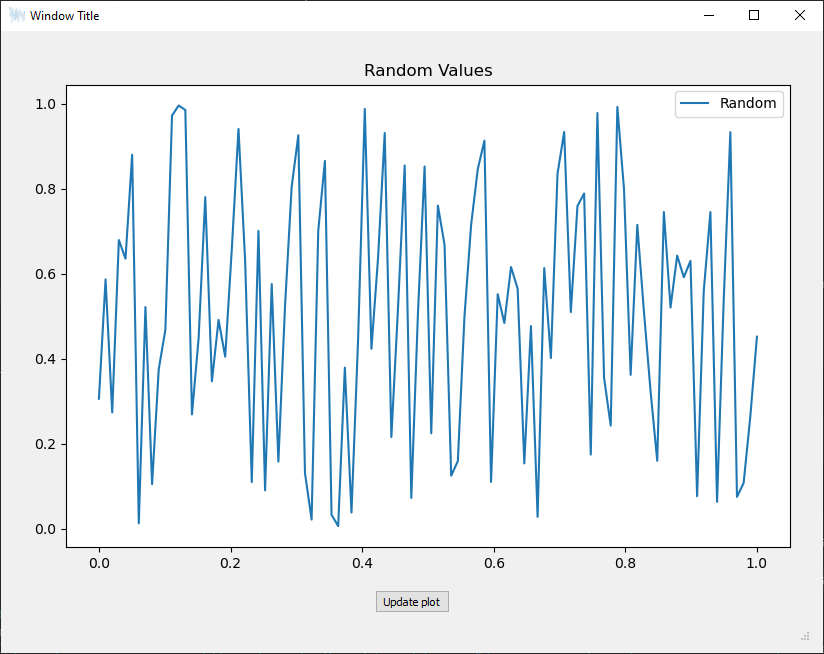

# EasyPlotGUI
 Python library that makes it easy to have a Qt GUI with a matplotlib widget made in QtDesigner implemented on a script.

 # Easy implementation process
 1. Create GUI on QtDesigner based on `mpl_gui.ui`
 2. Import EasyPlotGUI
 3. Overwrite `update_graph()` with graph to be generated; and `update_interactivity()` with GUI elements interaction

 ## QtDesigner
 ### Installation
QtDesigner is a Graphical tool for creating Guided User Interfaces that can either be downloaded with Qt Creator or with the library `pyqt5-tools`.

Lightest and fastest way to get QtDesigner is to install `pyqt5-tools`. For this, execute:

```
pip install pyqt5-tools
```

After the installation, the `designer.exe` executable should be found in:

```
Python3X\Lib\site-packages\pyqt5_tools\Qt\bin\designer.exe
```

I suggest creating a shortcut for it, for easier execution or adding the folder to the path, so that it can be called as just `desginer` from the terminal/shell.

### UI with Matplotlib Creation

Use the `mpl_gui.ui` file on QtDesigner as a starting point for the GUI with Matplotlib integrated. Just keep in mind that the names of every object added to the User Interface are those you will have to call on the Python script.

The only important thing in this .ui file is the MplWidget object. The MplWidget is the widget created to link matplotlib to Qt. Do not delete it.

## Example of Usage


``` python
from easy_gui import EasyPlotGUI

class MyClass(EasyPlotGUI):
    def __init__(self):
        super().__init__()
        self.window_title="My GUI Name"
        self.ui_filepath="X:/xxxxx/xxxx/your_GUI.ui"
        self.icon_path="X:/xxxxx/xxxx/your_GUI_icon.png"

        #initialize Graph variables for first plot
        self.f=1
    
    def update_interactivity(self):
        self.ui.mySlider.valueChanged(self.change_frequency())
    
    def change_frequency(self):
        self.f=self.ui.mySlider.value()
        self.update_graph()
    
    def update_graph(self):
        x=np.linspace(0,1)
        y=np.sin(2*np.pi*self.f*x)

        self.ax.clear()
        self.ax.plot(x, y, label="Sine")
        self.ax.legend()
        self.ax.set_title('Sine Wave')
        self.canvas.draw()

#calling it
my_gui=MyClass()
my_gui.show_gui()
```
### Test Example

``` python
gui = EasyPlotGUI()
gui.window_title="Window Title"
gui.ui_filepath="test_example.ui"
gui.icon_path="./logo.png"
gui.show_gui()
```


